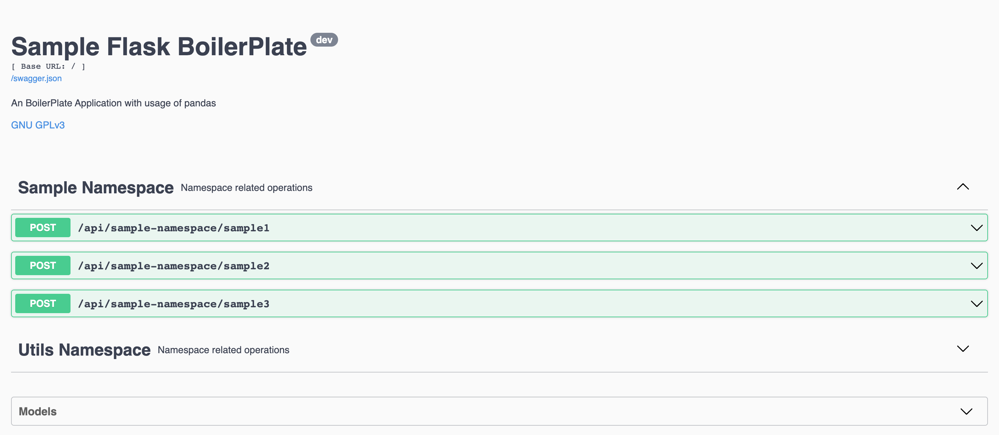

# My RESTful API Boilerplate

## Author
[Daniel](https://github.com/nargotik)

## Description

This project serves as a boilerplate for creating RESTful APIs using Flask and Swagger. It is specifically designed to integrate with databases and leverages Python's Pandas and NumPy for data processing. The API can be utilized in conjunction with other programming languages to streamline complex database queries or even multiple databases for data analysis and result rendering.




## Technologies Used

- Flask
- Flask-RESTx
- SQLAlchemy
- mysql.connector
- pymysql
- NumPy
- Pandas
- Gunicorn
- psutil
- cachetools

## Features

- Two sample namespaces (`sample_namespace` and `utils_namespace`) located in `sample.py` and `utils.py` within the `api` folder.
- Database connectivity to MySQL demonstrated in `database.py`.
- A `pandas_sample.py` file that serves as a proof-of-concept for using Pandas to generate API responses. This can be thought of as a stand-in for a Jupyter Notebook with defined functions for API endpoints.
- Function caching using `cachetools` to avoid unnecessary queries.
- Dockerized using Gunicorn with 4 workers, configurable via the Dockerfile.

## Building the Docker Image

To build the Docker image for this project, you can run the following command after copy `.env.example` to `.env`:

```bash
cp .env.example .env
make build
```

The build process utilizes the `Makefile` located in the `deploy` folder.

## Running the Project

To start the project, you can use:

```bash
make start
```

And to stop it:

```bash
make stop
```

These commands also use the `Makefile` in the `deploy` folder.

## Configuration

The `deploy` folder contains a `docker-compose.yml` file and a sample `.env` file for database connections. Update the `.env` file as needed to connect to your own database instance.

## License

This project is licensed under the GNU General Public License v3.0. For more information, see [GNU GPLv3 License](https://www.gnu.org/licenses/gpl-3.0.en.html).

---

For more details, feel free to explore the codebase or reach out with questions.
